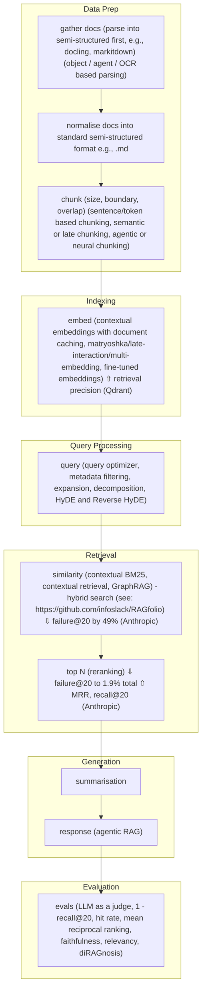

```mermaid

graph TD
    subgraph Data Prep
        direction TB
        A1["gather docs (parse into semi-structured first, e.g., docling, markitdown) (object / agent / OCR based parsing)"]
        A2["normalise docs into standard semi-structured format e.g., .md"]
        A3["chunk (size, boundary, overlap) (sentence/token based chunking, semantic or late chunking, agentic or neural chunking)"]
    end

    subgraph Indexing
        B1["embed (contextual embeddings with document caching, matryoshka/late-interaction/multi-embedding, fine-tuned embeddings) ⇧ retrieval precision (Qdrant)"]
    end

    subgraph Query Processing
        C1["query (query optimizer, metadata filtering, expansion, decomposition, HyDE and Reverse HyDE)"]
    end

    subgraph Retrieval
        D1["similarity (contextual BM25, contextual retrieval, GraphRAG) - hybrid search (see: https://github.com/infoslack/RAGfolio) ⇩ failure@20 by 49% (Anthropic)"]
        D2["top N (reranking) ⇩ failure@20 to 1.9% total ⇧ MRR, recall@20 (Anthropic)"]
    end

    subgraph Generation
        E1["summarisation"]
        E2["response (agentic RAG)"]
    end

    subgraph Evaluation
        F1["evals (LLM as a judge, 1 - recall@20, hit rate, mean reciprocal ranking, faithfulness, relevancy, diRAGnosis)"]
    end

    A1 --> A2 --> A3 --> B1 --> C1 --> D1 --> D2 --> E1 --> E2 --> F1
```