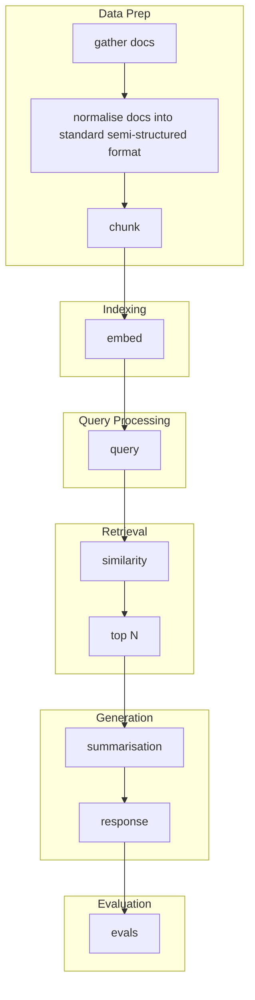

```mermaid

graph TD
    subgraph Data Prep
        direction TB
        A1[gather docs]
        A2[normalise docs into standard semi-structured format]
        A3[chunk]
    end

    subgraph Indexing
        B1[embed]
    end

    subgraph Query Processing
        C1[query]
    end

    subgraph Retrieval
        D1[similarity]
        D2[top N]
    end

    subgraph Generation
        E1[summarisation]
        E2[response]
    end

    subgraph Evaluation
        F1[evals]
    end

    A1 --> A2 --> A3 --> B1 --> C1 --> D1 --> D2 --> E1 --> E2 --> F1


```