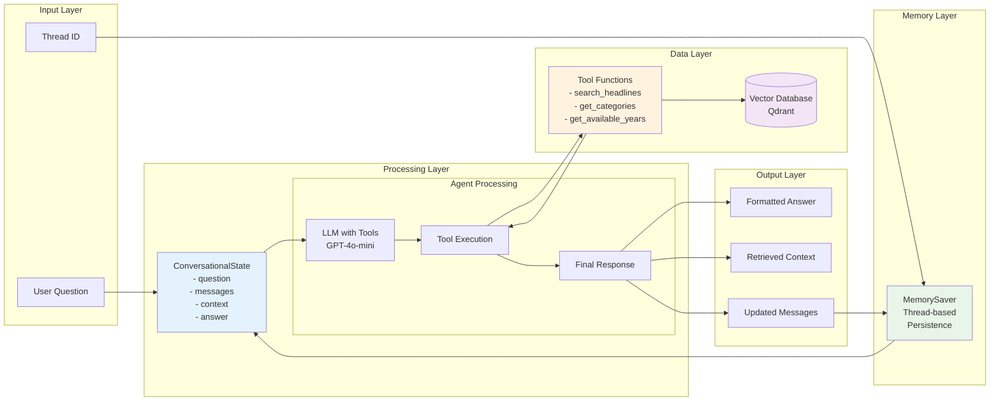
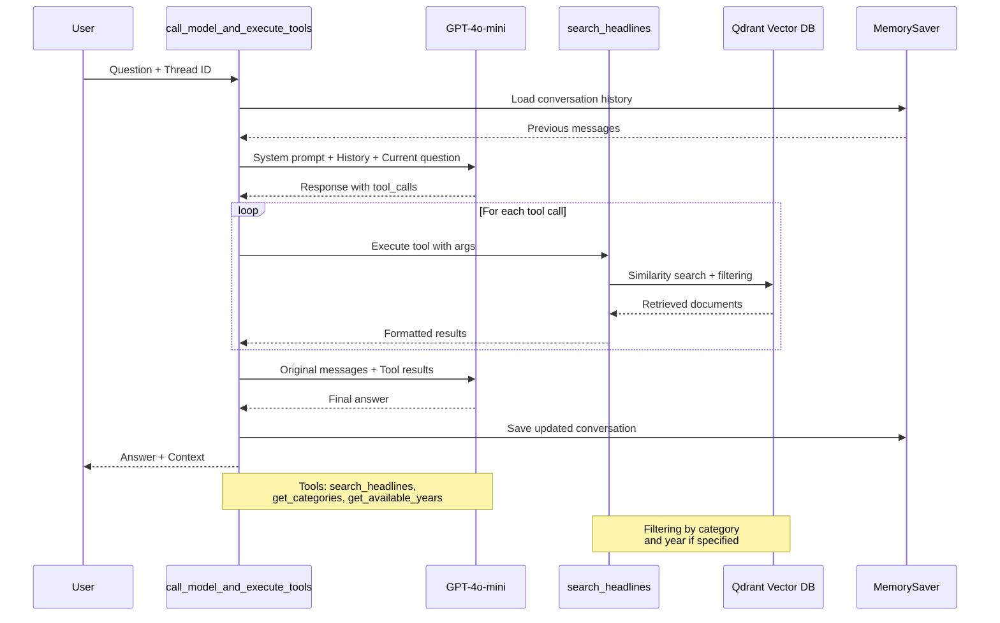
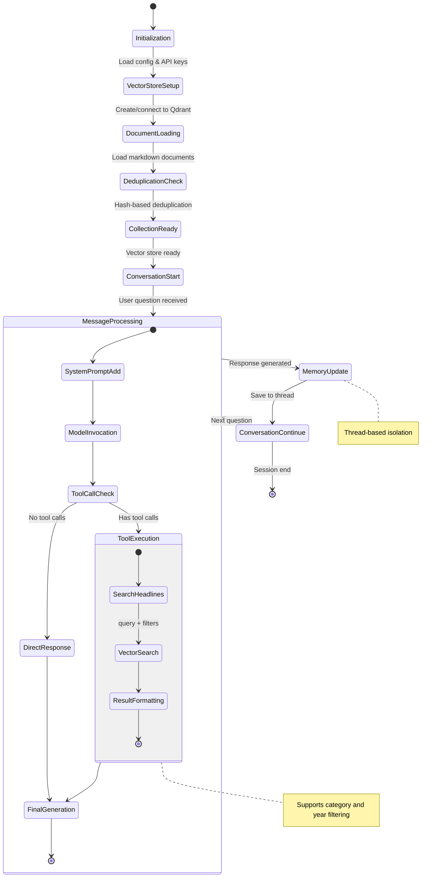
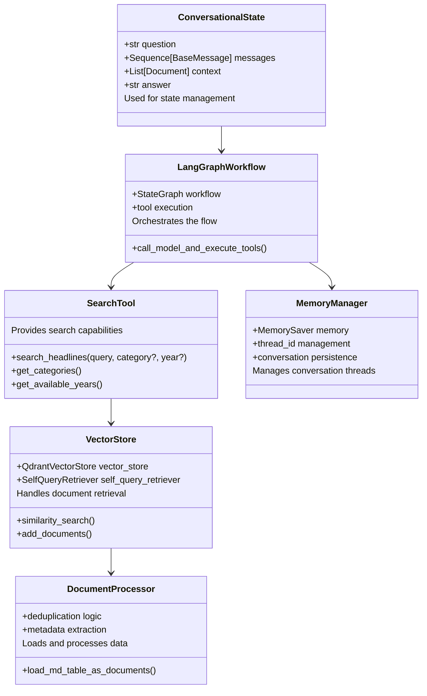
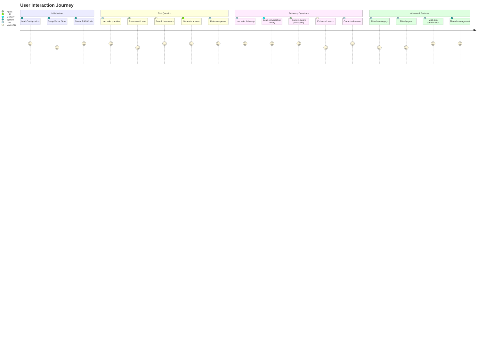
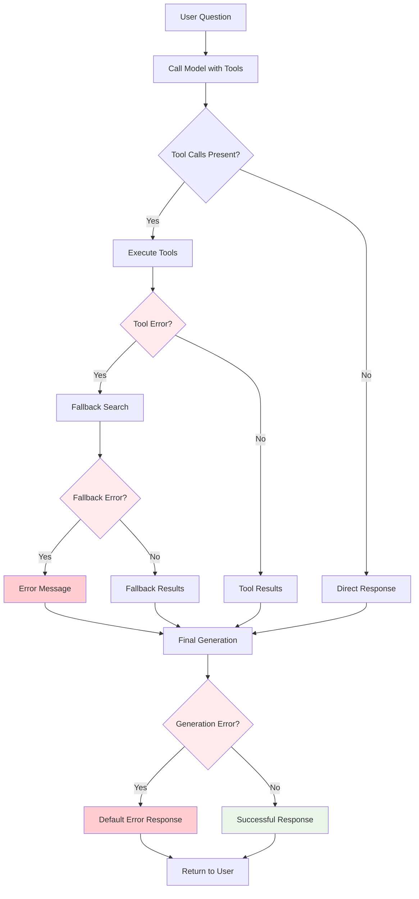

# Conversational RAG Module Architecture

This document contains Mermaid.js diagrams illustrating the architecture and flow of the `03_rag_pt2.py` conversational RAG module.

## System Overview

```mermaid
graph TB
    subgraph "External Dependencies"
        OpenAI[OpenAI API<br/>GPT-4o-mini + Embeddings]
        QdrantDB[(Qdrant Vector DB<br/>2500 PE Headlines)]
        ConfigFiles[Config Files<br/>utils/config_loader.py<br/>utils/secrets_loader.py]
    end

    subgraph "Core Module: 03_rag_pt2.py"
        Main[main()]
        VectorStore[setup_vector_store()]
        SelfQuery[create_self_query_retriever()]
        RAGChain[create_conversational_rag_chain()]
        
        subgraph "Tools"
            SearchTool[search_headlines]
            CategoresTool[get_categories]
            YearsTool[get_available_years]
        end
        
        subgraph "LangGraph Workflow"
            Agent[call_model_and_execute_tools]
            Memory[MemorySaver<br/>Thread-based Storage]
        end
        
        subgraph "User Interfaces"
            Interactive[interactive_chat_loop]
            Demo[run_demo_with_tools]
            Test[--test mode]
        end
    end

    ConfigFiles --> Main
    Main --> VectorStore
    Main --> SelfQuery
    Main --> RAGChain
    VectorStore --> QdrantDB
    RAGChain --> Agent
    RAGChain --> Memory
    Agent --> SearchTool
    Agent --> CategoresTool
    Agent --> YearsTool
    SearchTool --> QdrantDB
    Agent --> OpenAI
    Main --> Interactive
    Main --> Demo
    Main --> Test

    style OpenAI fill:#e1f5fe
    style QdrantDB fill:#f3e5f5
    style Memory fill:#e8f5e8
    style Agent fill:#fff3e0
```

## Data Flow Architecture



## Tool Execution Flow



## State Management



## Component Relationships



## System Interaction Flow



## Error Handling & Fallbacks



## Key Features Summary

### Architecture Highlights

- **Modular Design**: Clean separation between tools, memory, and processing
- **Thread-based Memory**: Isolated conversation threads for multiple users
- **Tool Integration**: Automatic tool selection and execution
- **Error Resilience**: Multiple fallback mechanisms
- **Scalable**: Support for concurrent conversations

### Technical Stack

- **LangChain**: Core RAG framework
- **LangGraph**: Workflow orchestration
- **Qdrant**: Vector database for document storage
- **OpenAI**: LLM and embedding models
- **Custom Tools**: Domain-specific search and filtering

### Performance Characteristics

- **Setup Time**: ~3 seconds (vector store initialization)
- **Query Processing**: ~6 seconds (tool execution + generation)
- **Memory Overhead**: Minimal (thread-based isolation)
- **Document Capacity**: 2500+ documents with deduplication
